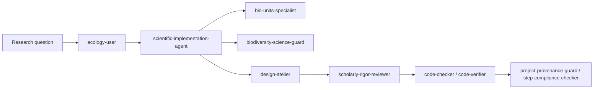
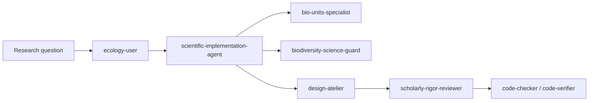

# biodiversity-agents-lab

A curated library of specialist AI agents for biodiversity and macroecology research. Agent definitions are stored in `agents/` (local) and `.github/agents/` (VS Code-visible) and mirrored to the public library at [`MacroecologyLab_Agents`](https://github.com/benquist/MacroecologyLab_Agents).

## Agent library

| Agent | Role |
|-------|------|
| `always` | Mandatory final gate: prompt log, Rmd compile, git push verification |
| `bio-units-specialist` | Trait unit inference, SI conversion, biological bounds |
| `biodiversity-informatics-checker` | Darwin Core compliance, coordinate QA, occurrence validation |
| `biodiversity-science-guard` | Ecology/taxonomy norms, native/introduced interpretation, provenance transparency |
| `code-checker` | First-pass bug and quality review |
| `code-verifier` | Independent second review and final sign-off |
| `coder` | Writes new code and implements features |
| `design-atelier` | Scandinavian-minimalist design for READMEs, reports, Shiny UIs |
| `EcoInterface` | Ecological data interface and user-facing workflow design |
| `ecology-user` | Classifies data type, scale, biases, and ecological workflow |
| `enhanced-theory` | Theoretical ecology framing and hypothesis development |
| `long-job-progress-reporter` | Progress reporting for long-running R/ETL jobs |
| `m` | Supervisor orchestrator — delegates to specialist agents |
| `merow-ecology` | SDM/ENM ecological reasoning, transferability, uncertainty |
| `optimizer` | Performance profiling, vectorization, bottleneck resolution |
| `project-provenance-guard` | Verifies per-project chat provenance logs are current |
| `r-code-documenter` | Scientist-readable R code and workflow documentation |
| `richard-telford` | Statistical ecology posture (palaeoSig, rioja, blocked CV, ordination) |
| `scandinavian-design` | Alias for design-atelier with explicit Scandinavian design framing |
| `scholarly-rigor-reviewer` | Citations, statistical inference, reproducibility, and claims audit |
| `scientific-implementation-agent` | Reproducible analysis plans, R Markdown, modular functions |
| `stats-specialist` | Statistical analysis, regression, Bayesian, SDM, mixed models |
| `step-compliance-checker` | Verifies every prompt step is fully completed |
| `taxonomy-reconciliation` | Taxonomic name reconciliation and synonym resolution |
| `ter-braak-multivariate` | Multivariate ordination and constrained analysis |
| `uncertainty-feedback-guard` | Flags overconfident claims; enforces uncertainty disclosure |

## Recommended workflow

## Provenance

- Prompt history: `agents/prompt_log.md`
- Agent change log: `agents/agent_chat_provenance_log.txt`
- Public mirror: [`MacroecologyLab_Agents`](https://github.com/benquist/MacroecologyLab_Agents)
  - `ecology-user`
  - `design-atelier`
- Keep agent-driven work transparent by logging prompts in `agents/prompt_log.md` and project-level changes in `<project>/chat_provenance_log.md`.

## Agent workflow for new graduate students

If you are new to AI-supported scientific workflows, treat these agents as specialist teammates. A simple workflow is:

1. Define your research question clearly.
2. Ask `ecology-user` to describe the data type, scale, biases, and ecological workflow.
3. Ask `scientific-implementation-agent` to draft a reproducible analysis plan and file structure.
4. Use `bio-units-specialist` for measurement unit inference or conversion.
5. Use `biodiversity-science-guard` to audit biodiversity data standards and provenance.
6. Use `design-atelier` to make the README or report easier to follow.
7. Use `scholarly-rigor-reviewer` before sharing or publishing.
8. Use `code-checker` and `code-verifier` for code quality, then `step-compliance-checker` for final completion.

### Why this matters

This approach helps you:

- keep scientific decisions transparent
- avoid hidden assumptions
- preserve provenance for reproducibility
- separate design from domain review
- turn agent responses into documented workflows

