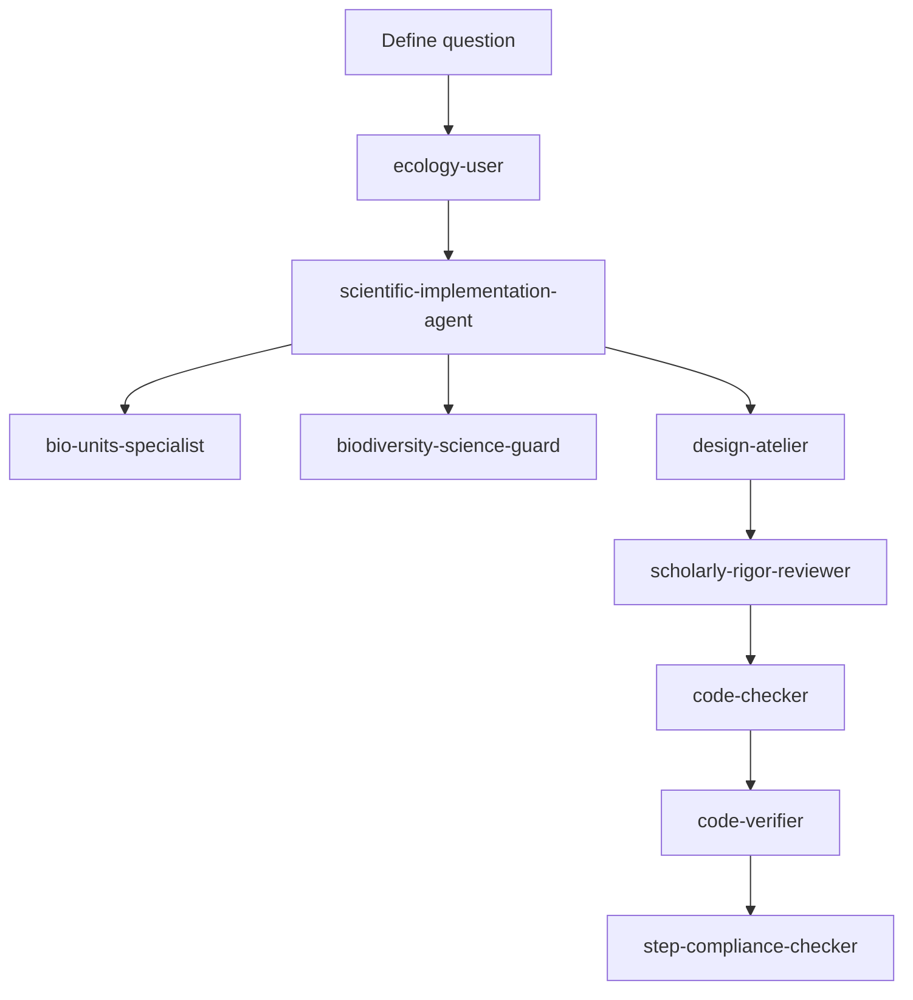

# Macroecology AI Agents

This folder contains the AI agent definitions used for biodiversity and macroecology research in this workspace. The agent library is intended to be a reusable specialist toolkit and a public reference copy for `https://github.com/benquist/MacroecologyLab_Agents`.

## Who should read this

This guide is written for a new graduate student who is starting with biodiversity data, ecological workflows, and project design. If you are not yet comfortable with agent-based workflows, treat agents as specialist teammates that help you:

- frame the scientific problem
- build reproducible code and documentation
- enforce biodiversity and unit standards
- audit claims and citations
- keep your work transparent and traceable

## Core agent roles in this workspace

### `ecology-user`
- Role: ecological data reasoning and workflow framing
- Use when you need to identify data type, scale, bias, spatial/temporal structure, and ecological plausibility.
- Example prompt:
  - "You are the ecology-user. Given this dataset and research question, identify the data type, scale, likely sampling biases, appropriate analytical framework, uncertainty sources, and an ecological workflow with headings: Data type & scale, Bias & uncertainty, Modeling approach, Plausibility check, Reproducible workflow, Expansion opportunities."

### `scientific-implementation-agent`
- Role: workflow builder and reproducible implementation specialist
- This is the workspace's scientific specialist role.
- Use when you need code structure, file organization, an RMarkdown workflow, or a documentation draft.
- Example prompt:
  - "You are the scientific-implementation-agent. Create a reproducible R Markdown outline and script plan for trait harmonization, unit inference, QA checks, and output reporting. Include file names, modular functions, and a reproducibility checklist."

### `bio-units-specialist`
- Role: trait and measurement unit inference, conversion, and validation
- Use when raw ecological data has missing, inconsistent, or ambiguous units.
- Example prompt:
  - "You are the bio-units-specialist. Infer canonical units for these columns, propose conversion factors to standard SI units, flag low-confidence cases, and document biological bounds and citations."

### `biodiversity-science-guard`
- Role: biodiversity science QA and domain-specific audit
- Use when reviewing biodiversity data, taxonomic reconciliation, coordinate QA, provenance, or native/introduced interpretation.
- Example prompt:
  - "You are the biodiversity-science-guard. Audit this occurrence/trait pipeline for Darwin Core compliance, taxonomic uncertainty handling, coordinate validity, provenance transparency, and ecosystem plausibility. Return critical issues, likely issues, assumptions, evidence, recommended fixes, and a validation plan."

### `design-atelier`
- Role: UX, communication design, and presentation quality
- Use when you want the look and feel, structure, and clarity of a README, app UI, or report.
- Example prompt:
  - "You are the design-atelier agent. Improve the README or app help page for a biology audience by simplifying the workflow, sharpening headings, adding visual flow, and suggesting diagrams or callouts."

### `scholarly-rigor-reviewer`
- Role: publication-grade review of claims, citations, reproducibility, and scientific rigor
- Use before sharing documents, reports, or analysis summaries.
- Example prompt:
  - "You are the scholarly-rigor-reviewer. Review this text and code comments for unsupported claims, missing citations, reproducibility gaps, and statistical weaknesses. Provide structured feedback under headings: Summary judgment, Critical issues, Citation audit, Statistical audit, Reproducibility audit, Recommended fixes."

### `code-checker`
- Role: first-pass code quality and error detection
- Use after code changes to catch logic bugs, syntax issues, and potential regressions.
- Example prompt:
  - "You are the code-checker. Review this code for correctness, edge cases, variable misuse, and maintainability issues. Return only actionable findings."

### `code-verifier`
- Role: independent second review after fixes
- Use after `code-checker` issues are addressed to verify the final change.
- Example prompt:
  - "You are the code-verifier. Confirm that the updated code is correct, that previous issues have been resolved, and that there are no new regressions."

### `project-provenance-guard`
- Role: provenance compliance and chat log coordination
- Use when a project folder or agent file is changed.
- Example prompt:
  - "You are the project-provenance-guard. Check that this project has an up-to-date `chat_provenance_log.md` entry and that the agent prompt history reflects the change."

### `step-compliance-checker`
- Role: task completion gatekeeping
- Use as the last check before finalizing a response or merge.
- Example prompt:
  - "You are the step-compliance-checker. Confirm that all prompt requirements are met, all requested files are updated, and the checklist is complete."

### `stats-specialist`
- Role: statistical modeling and inference review
- Use for regression, model selection, uncertainty, and inference diagnostics.
- Example prompt:
  - "You are the stats-specialist. Review this modeling plan and code for assumptions, overfitting risk, validation design, and appropriate error reporting."

### `merow-ecology`
- Role: species distribution modeling and ecological realism
- Use for SDM/ENM, niche modeling, transferability, and biogeographic interpretation.
- Example prompt:
  - "You are the merow-ecology agent. Evaluate this SDM workflow for ecological realism, transferability risk, predictor choice, and validation strategy."

### `r-code-documenter`
- Role: scientist-readable method and code documentation
- Use for README updates, code comments, methods sections, and workflow notes.
- Example prompt:
  - "You are the r-code-documenter. Rewrite this analysis description into a concise, reproducible methods section for a biology audience."

### `taxonomy-reconciliation`
- Role: taxonomic name matching and backbone reconciliation guidance
- Use for species name mapping, synonym handling, and taxonomic provenance.
- Example prompt:
  - "You are the taxonomy-reconciliation agent. Advise on matching these names to a backbone taxonomy and on documenting uncertain or infraspecific matches."

## How to use agents in a workflow

Start with a single clear question, then move through the specialist chain. For example:

1. Use `ecology-user` first to define the scientific problem, data type, scale, and bias sources.
2. Use `scientific-implementation-agent` to draft the workflow, script structure, and documentation.
3. Use `bio-units-specialist` when units or trait measurements are present.
4. Use `biodiversity-science-guard` to audit domain-specific biodiversity and provenance issues.
5. Use `design-atelier` to make the README or report easy to read and visually clear.
6. Use `scholarly-rigor-reviewer` for a final claims/citation/reproducibility audit.
7. Use `code-checker` and `code-verifier` for code quality.
8. Use `project-provenance-guard` and `step-compliance-checker` for final compliance.

## Example agent pairing for README/design work

- Start with `ecology-user` to make sure the scientific context and target audience are clear.
- Then ask `design-atelier` to improve the structure, flow, and visual storytelling.
- Finally ask `scholarly-rigor-reviewer` to verify scientific claims and reproducibility language.

Example prompt:
- "First, you are ecology-user. Review this draft and tell me whether the target audience is a new graduate student, which assumptions need to be explicit, and what the core workflow steps should be. Then you are design-atelier. Rewrite the README sections to be clearer, add a diagram, and suggest a scientific-friendly layout. Finally you are scholarly-rigor-reviewer. Audit the final language for unsupported claims, missing reproducibility details, and citation gaps."

## Practical prompts for new students

- "I am a new graduate student. I have plant occurrence and trait data. Help me choose the right workflow and document it clearly."
- "Show me how to use these agents together to go from raw data to reproducible output, with explicit headings and an example checklist."
- "Help me write a README that explains the science, the data steps, and the quality assurance checks."

## Syncing this library to `MacroecologyLab_Agents`

This repository is a local source for the Macroecology agent library and should be mirrored to `https://github.com/benquist/MacroecologyLab_Agents`. A local staging mirror now exists at `../MacroecologyLab_Agents/`.

That public copy should include:

- `agents/` definitions
- `agents/README.md`
- example prompts for priority agents
- guidance for new students and reproducible workflows
